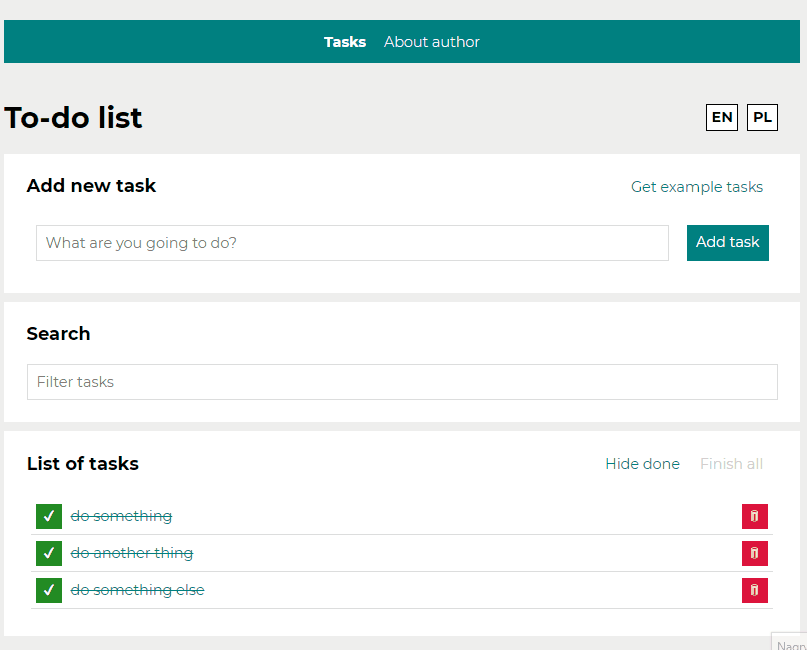
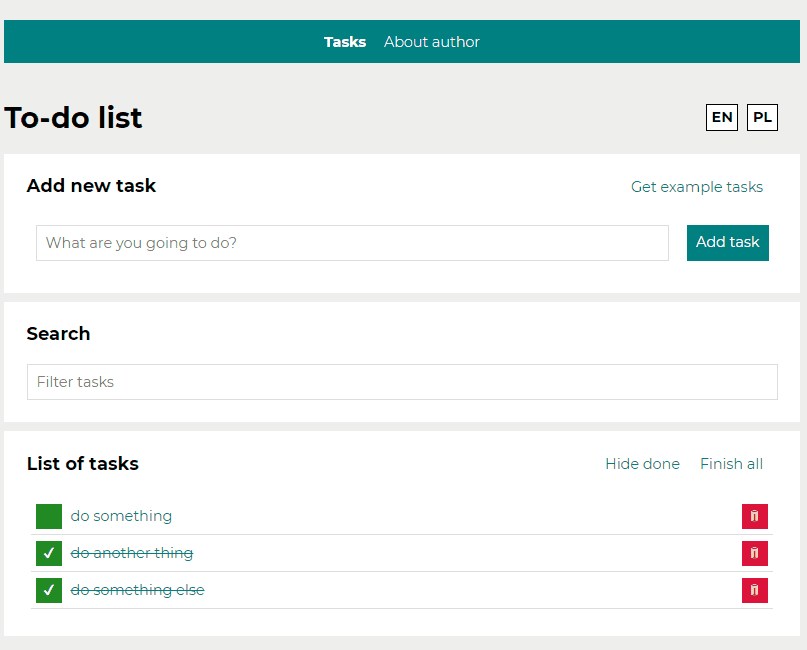
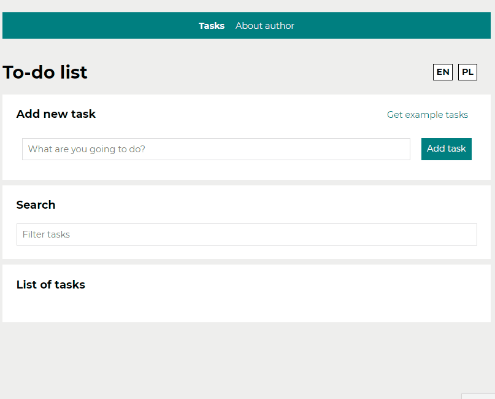
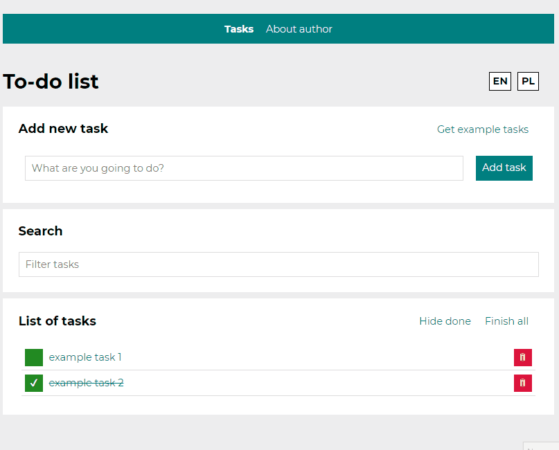

# Todo-list

Todo list made using React.js

## Demo:

https://mcesarczyk.github.io/todo-list-react/

## Used technologies:

- html
- CSS
- CSS-Flexbox
- CSS-Grid
- Media queries
- JS/ES6+
- BEM
- Immutability
- React/toolkit (JSX, components)
- Styled components, global style, theme provider
- Asynchronity/hooks (useState, useEffect, useRef, custom hooks)
- localStorage (XHR, fetch, axios)
- React-redux (app global state handling)
- Redux-Saga (side effects, local storage management)

## Short description:

With this app You're able to:

- add/remove tasks
- mark it as done individually
- mark as done all at once
- hide done tasks
- view single task details
- change interface language
- fetching sample tasks to test functions
- search thru tasks using simple search
- view page containing info about author

Additionally, the app automatically saves content and state of wtitten down tasks as well as chosen laguage in local storage.

## How to use this app:

1. To add task write its content and click "Add task" button or simply click Enter.
   

1. If you want to mark task as done click on green field on the list. In the same way you can uncheck chosen tasks.
   

1. If you want to hide all done tasks clisk on button "Hide done". Description on button will now change to "Show done". To restore tasks, click this button again.
   

1. When you done all task and want to check them, click on "Finish all". Please notice that button will now become inactive, but if you uncheck any task, button will become active again.
   

1. To remove single task click on red button with trash bin icon on right. When you remove all task buttons above list will disappear.
   

1. When you want quickly fill in the list, you can fetch example tasks, using proper button.
   

1. If you would like to change aplication language to polish, you can do it by clicking button at the top of a form with abreviation "PL". To switch back to english use proper button marked with "EN".
   

1. You can find any task using embedded search engine.
   

1. To view details of single task, simply click on it.
   

1. You can also read few words about aplication author in both languages.
   

1. When there will be problem with tasks, you'll get proper information.
   

1. When will be problem with fetching example tasks, you'll also be noticed.
   

1. When you will open the app with the same browser your tasks and language settings will be there.

# Powered by [Vite](https://github.com/vitejs/vite).

## Available Scripts

In the project directory, you can run:

### `yarn dev`

Runs the app in the development mode.\
Open [http://localhost:3000](http://localhost:3000) to view it in the browser.

The page will reload if you make edits.\
You will also see any lint errors in the console.

### `yarn build`

Builds the app for production to the `build` folder.\
It correctly bundles React in production mode and optimizes the build for the best performance.

The build is minified and the filenames include the hashes.\
Your app is ready to be deployed!

You can check build by running:

### `yarn serve`
